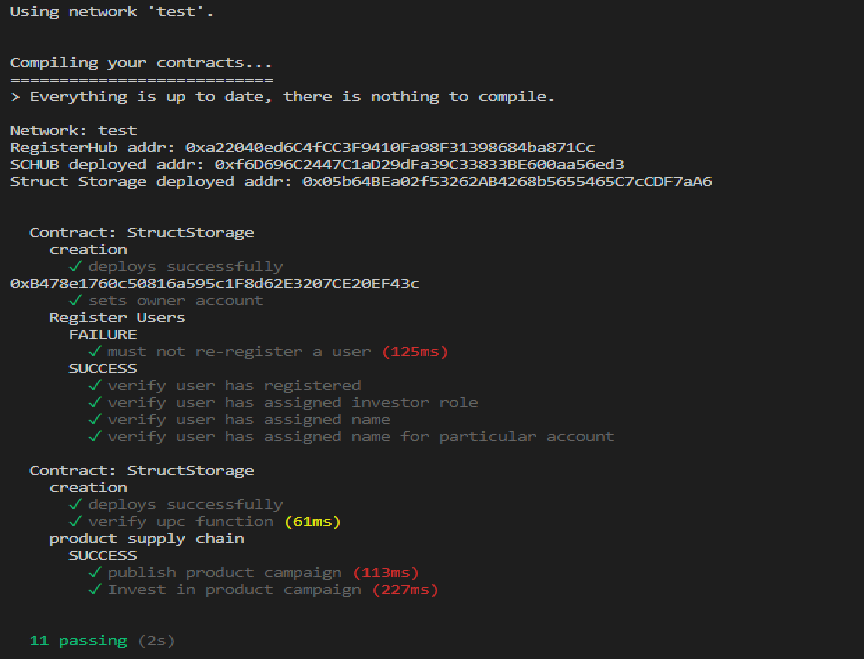

# Agricultural Marketplace Crowdfunding

### Description

This project aims to solve the problem of publishing & tracking the full supply chain from the product funding campaign through harvest and finally being sold through a agricultural marketplace to the consumers' hands.

This document uses UML to describre the general structure and functions that this Smart Contract offers to the actors:

- Farmers
- Investors
- Donors
- Consumers (Forward Market/Spot Market)
- Marketplace Manager

### Activity Diagram

This diagram shows the different actors and the interactions with the system.


### Sequence Diagram

This diagram shows the communication between the different objects and their life cycle.


### State Diagram

This diagram shows the different states of each object and the events or conditions that change those states.


### Data Modeling Diagram

This diagram shows the different Smart Contracts and the relation between them


### DApp State Machine

This visualization shows state machine that controls product stages and user interaction navigation in deterministic fashion.


## Getting Started

These instructions will get you a copy of the project up and running on your local machine for development and testing purposes. See deployment for notes on how to deploy the project on a live system.

### Prerequisites

Please make sure you've already installed ganache-cli, Truffle and enabled MetaMask extension in your browser.


### Installation

A step by step series of examples to get a development env running

Clone this repository:

```
git clone https://github.com/mukulChandYadav/AgriculturalMarketplaceCrowdfunding
```

Install all requisite npm packages (as listed in ```package.json```):

```
npm install
```

Launch Ganache:

```
ganache-cli -m "drama repeat eagle about favorite garbage battle balance slight catalog surround visual"
```

In a separate terminal window, Compile & migrate smart contracts:

Migration deploys smart contracts to the locally running blockchain, ganache-cli:

```
truffle migrate
```


This will create the smart contract artifacts in folder ```src\artifacts\``` and deploy them to local blockchain.


Test smart contracts by running another blockchain on test network:

```
ganache-cli -m <mnemonic> -p 8546
truffle test --network test
```

All 15 tests should pass.



In a separate terminal window, launch the DApp:

```
npm run build (Prod/Build)
npm run start (Dev)
```

## Built With

* [Ethereum](https://www.ethereum.org/) - Ethereum is a decentralized platform that runs smart contracts
* [Truffle Framework](http://truffleframework.com/) - Truffle is the most popular development framework for Ethereum with a mission to make your life a whole lot easier.


## Authors

* Abhijeet Kumar
* Mukul Chand Yadav


## Acknowledgments

* Dr. Richard Newman, UF CISE Department


## Credits & References
 
* [Solidity](https://docs.soliditylang.org/en/v0.4.24/)
* [Truffle Suite](https://trufflesuite.com/) - The most popular blockchain development suite
* [web3.js - Ethereum JavaScript API](https://web3js.readthedocs.io/en/v1.2.11/)
* [ganache-cli](https://www.npmjs.com/package/ganache-cli) - Fast Ethereum RPC client for testing and development

* [AgroChain](https://github.com/Kerala-Blockchain-Academy/AgroChain) - Agricultural Supply Chain Dapp With Micro-Finance
* [DApp for Coffee Supply Chain](https://github.com/axelgalicia/blockchain-supply-chain)
* [Supply chain DApp](https://github.com/dappuniversity/supply_chain) - Dapp University supplychain POC
* [XState](https://github.com/davidkpiano/xstate) - JavaScript State machines and statecharts for the modern web
* [xstate-examples](https://github.com/coodoo/xstate-examples) - A series of examples showing how to model application state with statechart using xstate
* [Finite State Machines In React JS Using xstate](https://www.skcript.com/svr/finite-state-machines-in-react-js-using-xstate/)